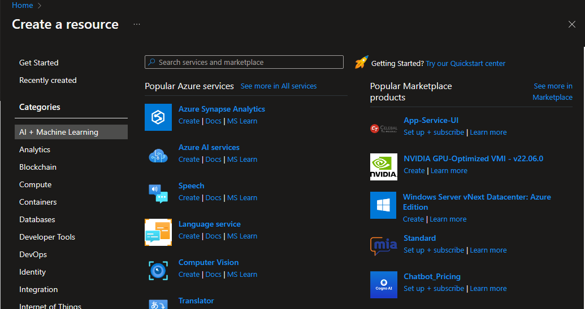
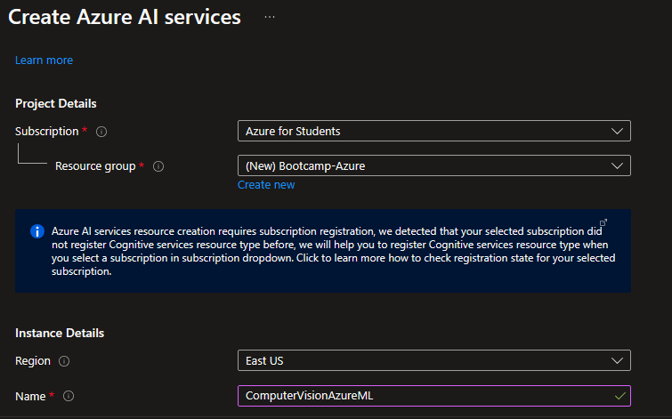
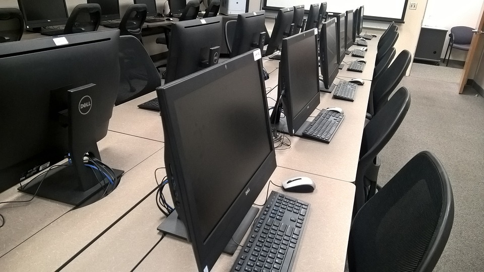
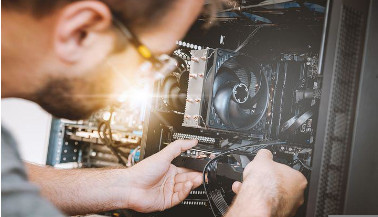
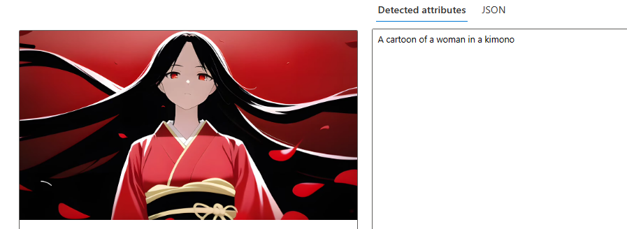

# Computer-Vision-in-Azure-ML

Esse repositório conta com a visão do computador no Azure Machine Learning, utilizando o recurso do Azure AI Services e o portal vision studio. Além de explicar como utilizar, existem diversas imagens de amostra e resultados demonstrando 3 funcionalidades específicas desse sistema de IA

## Criando o recurso e desenvolvendo os testes

1. Como de costume, você deve estar na tela inicial do portal do Azure e entrar no "Criar um recurso"

2. Entrando lá, clique na categoria de "AI + Machine Learning" e escolha o Azure AI Services

3. Para criar um recurso do "Azure AI Services", você deve fazer alguns dos procedimentos padrões: selecionar o grupo de recursos para o seu recurso (ou criar um novo) e colocar o nome do recurso

4. Contudo, essa parte seguinte é a que se difere com a do Azure ML. Além do que foi citado antes, dentro da região que você escolheu para hospedar o recurso, você deve colocar o Pricing tier (preço do tier), que por padrão, caso esteja em US East, será este abaixo. Por último, você deve checar a caixa de seleção confirmando os temos das notas da utilização desse Recurso de IA e confirmar a criação no Review + Create

5. Assim que for concluído, você deve ir para o portal que será utilizado nos testes (https://portal.vision.cognitive.azure.com/). Acessando-o, vá para o View All Resources (ou clique no recurso que estiver nessa região)

6. Dessa forma, você deve selecionar o recurso com o qual você vai trabalhar (o qual vai ser utilizado como base para as questões de análise de imagem e derivados), que será o que foi criado anteriormente. Passe o mouse no recurso e verá uma caixa de seleção redonda. Vendo ela, clique na mesma e confirme isso no "Select as default resource" (Selecione como recurso padrão)

7. Voltando ao início do portal, você pode escolher uma das funcionalidades e entrar pelo Try it out

8. Para cada funcionalidade que você utilizar, você deve confirmar que essa funcionalidade demo irá utilizar um pouco do recurso selecionado anteriormente na sua conta do Azure. Dessa forma, irá poder utilizar as ferramentas que irei mostrar por amostras e resultados.

A partir de agora, irei demonstrar em cada tópico seguinte as fucionalidades que utilizei no Vision Studio, e como acessá-las, junto com imagens do teste de cada uma

## Detecar rosto em uma imagem
Para acessar esse, você deve descer um pouco na tela inicial (o que serve para todos os próximos), selecionar a opção de rosto e depois clicar no "Try it out" do Detect faces in an image (detectar rosto em uma imagem)

Resumidamente, isso detecta se os rostos estão bem visíveis e, caso estejam cobertos de alguma forma, descreve o "mask: true" com o que possivelmente estaria os cobrindo

### Imagem 1

<b>Tradução</b>

> Rosto #1
>> Máscara facial: não (falso)

### Imagem 2

<b>Tradução</b>

>Rosto #1 (meio)
>>Máscara facial: não (falso)

>Rosto #2 (acima do meio)
>>Máscara facial: não (falso)

>Rosto #3 (2ª à esquerda)
>>Máscara facial: não (falso)

>Rosto #4 (1º à esquerda)
>>Máscara facial: sim (verdadeiro)
>>>Máscara facial cobrindo nariz e boca: não (falso)

>Rosto #5 (2ª à direita)
>>Máscara facial: sim (verdadeiro)
>>>Máscara facial cobrindo nariz e boca: não (falso)

>Rosto #6 (1º à direita)
>>Máscara facial: não (falso)

### Imagem 3

<b>Tradução</b>

>Rosto #1 (Elon Musk)
>>Máscara Facial: não (falso)

>Rosto #2 (Robô)
>>Máscara Facial: não (falso)

### Imagem 4

<b>Tradução</b>

>Rosto #1 (Loira)
>>Máscara facial: sim (verdadeiro)
>>>Máscara facial cobrindo nariz e boca: não (falso)

>Rosto #2 (Garota de cabelo roxo)
>>Máscara facial: não (falso)

>Rosto #3 (Garota de cabelo branco)
>>Máscara facial: sim (verdadeiro)
>>>Máscara facial cobrindo nariz e boca: não (falso)

>Rosto #4 (Homem no extremo canto esquerdo)
>>Máscara facial: não (falso)

## Extrair texto de imagem
Deve-se acessar o "Optical character recognition" e clicar no Try it out do Extract text from image (Extrair texto de imagens)

Como o próprio nome diz, ele serve para extrair textos oriundos de uma imagem, sendo ele da língua que for

### Imagem 1

### Imagem 2

### Imagem 3

### Imagem 4

### Imagem 5

## Adicionar legendas nas imagens
Por último, para acessár esse aqui, você deve ir no Image Analysis e ir até encontrar o Add captions to images

Esse daqui, verifica uma imagem e descreve com uma legenda, o que é possível ver na imagem com uma breve descrição

### Imagem 1

<b>Tradução</b>

Uma captura de tela (screenshot) de um website

### Imagem 2

<b>Tradução</b>

> Uma linha de computadores em uma mesa

### Imagem 3

<b>Tradução</b>

> Um sinal roxo e branco com a letra b

### Imagem 4

<b>Tradução</b>

> Uma pessoa vestindo uma máscara segurando uma taça de vinho

### Imagem 5

<b>Tradução</b>

> Um homem trabalhando (ou consertando) em/um computador

### Imagem 6

<b>Tradução</b>

> Uma pessoa em pé na água com a lua cheia atrás da mesma

### Imagem 7

<b>Tradução</b>

> Um desenho animado (cartoon/anime) de um garoto em pé em um muro com o castelo no fundo (background)

### Imagem 8

<b>Tradução</b>

> Um pagode (pagoda) com uma montanha no fundo (background)

### Imagem 9

<b>Tradução</b>

> Uma tenda no escuro

### Imagem 10

<b>Tradução</b>

> Um quadrado azul com uma luz brilhando ao redor dele

### Imagem 11

<b>Tradução</b>

> Uma garota de desenho animado (cartoon/anime) em uma sala de aula

### Imagem 12

<b>Tradução</b>

> Uma garota de desenho animado (cartoon/anime) em um kimono

### Imagem 13

<b>Tradução</b>

> Uma garota de desenho animado (cartoon/anime) com cabelo roxo e luvas rosas

### Imagem 14

<b>Tradução</b>

> Um headseat de realidade virtual com luzes de neon

### Imagem 15

<b>Tradução</b>

> Um planeta e uma galáxia no espaço
### Imagem 16

<b>Tradução</b>

> Uma silhueta da cabeça de uma pessoa com uma caneta na sua boca

## Conclusão
Dessa forma, é possível concluir, que, mesmo que seja uma pequena demonstração com algumas falhas na hora de analisar as imagens, é possível perceber que essa ferramente é muito interessante e bastante flexível (possível de ser utilizadas em diversas áreas), é somente necessário se aprofundar mais ou adquirir um plano melhor para as possibilidades poderem ser mais amplas

Ainda assim, esse aglomerado é tão grande que basicamente isso só foi uma pequena amostra (literalmente) do que o Vision Studio tem a oferecer, contudo, dá para dizer que são infinitas as possibilidades de análise de imagens por IA nela.

Dessa forma, finalizo essa pequena documentação da minha experiência utilizando o recurso Azure AI Services e seu portal. Até o próximo README!